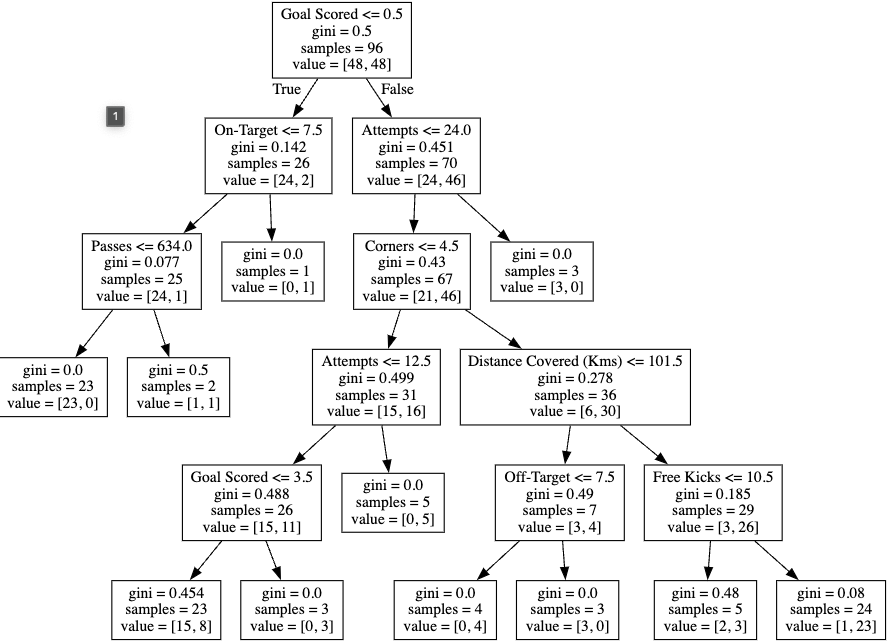
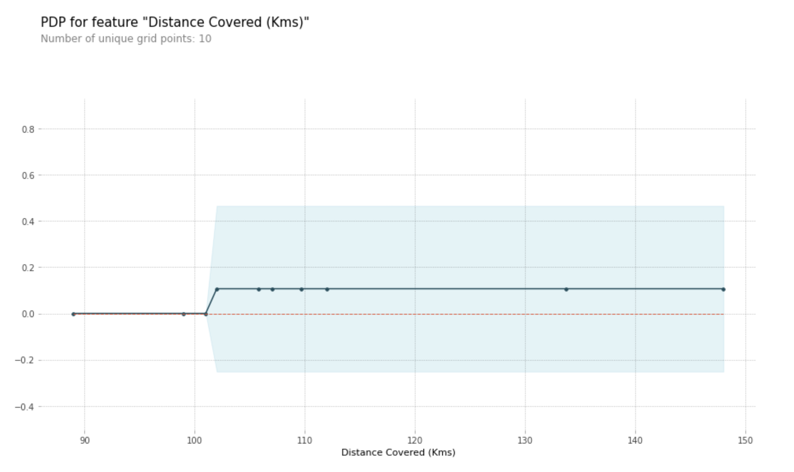
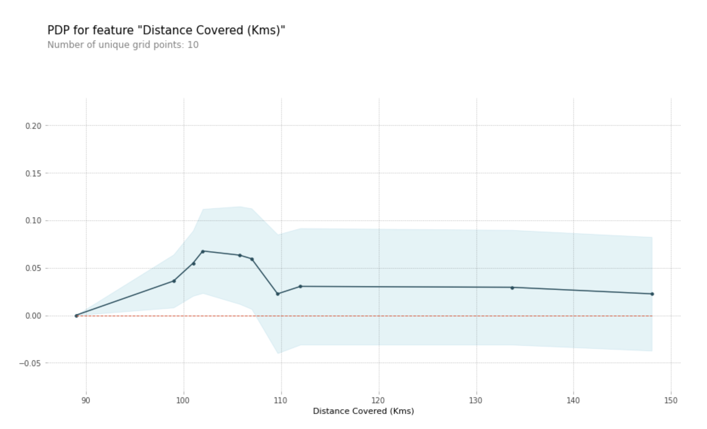
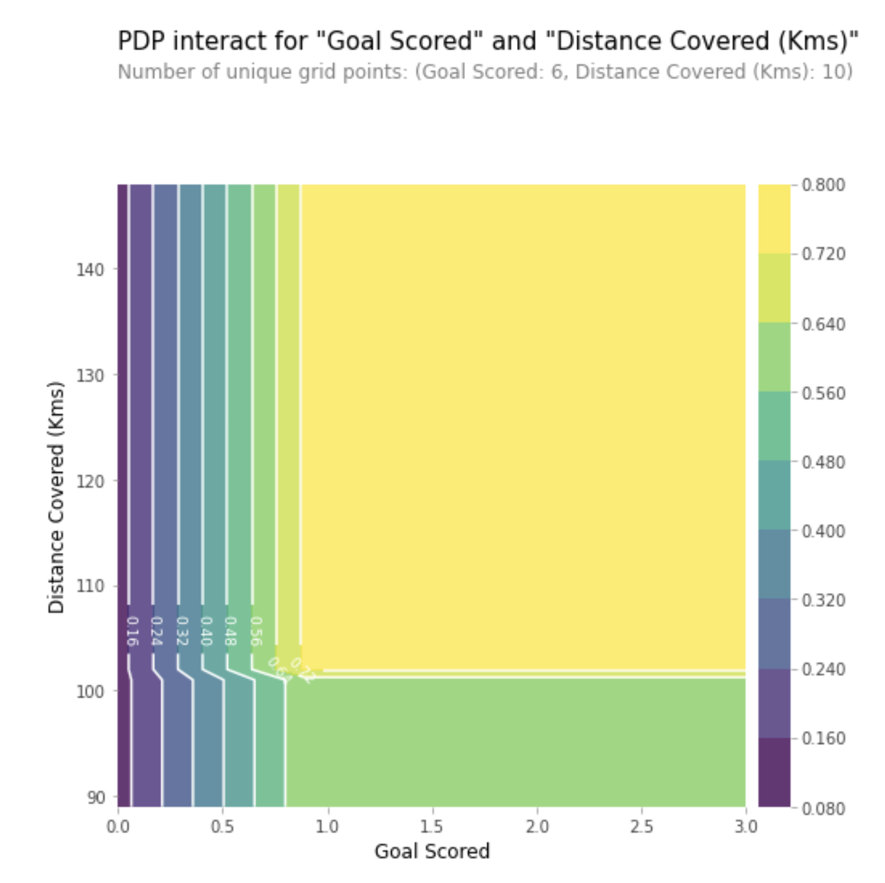

# Machine Learning Explainabilty

References: 

https://python-data-science.readthedocs.io/en/latest/explainability.html#partial-dependence-plots


## Intro: Use Cases for Model Insights

### What Types of Insights Are Possible?

Many people say machine learning models are "black boxes", in the sense that they can make good predictions but you can't understand the logic behind those predictions. This statement is true in the sense that most data scientists just _don't know how to extract insights from models_ (yet).

This repo contains techniques to extract the following insights from sophisticated machine learning models:

1. What **features** in the data did the model think are **most important**?
2. _For any single prediction_ from a model, how did each feature in the data affect that particular prediction?
3. How does each feature affect the model's predictions in a big-picture sense (what is its typical effect when considered over a large number of possible predictions)?

### Why Are These Insights Valuable

These insights have many uses, including

* Debugging
* Informing feature engineering
* Directing future data collection
* **Informing human decision-making**
* Building Trust

In detail..

#### Debugging

The world has a lot of unreliable, disorganized and generally dirty data. You add a potential source of errors as you write preprocessing code. Add in the potential for target leakage, and it is the norm rather than the exception to have errors at some point in a real data science project.

Given the frequency and potentially disastrous consequences of bugs, **debugging is one of the most valuable skills in data science**. Understanding the patterns a model is finding will help you identify when those are at odds with your knowledge of the real world, and this is typically the first step in tracking down bugs.

#### Informing Feature Engineering
**Feature engineering is usually the most effective way to improve model accuracy**. Feature engineering usually involves _repeatedly creating new features_ using transformations of your raw data or features you have previously created.

Sometimes you can go through this process using nothing but intuition about the underlying topic. But you'll need more direction when you have 100s of raw features or when you lack background knowledge about the topic you are working on.

As an increasing number of datasets start with 100s or 1000s of raw features, this approach is becoming increasingly important.

#### Directing Future Data Collection
You have no control over datasets you download online. But many businesses and organizations using data science have opportunities to expand what types of data they collect. Collecting new types of data can be expensive or inconvenient, so they only want to do this if they know it will be worthwhile. Model-based insights give you a good understanding of the value of features you currently have, which will **help you reason about what new values may be most helpful**.

#### Informing Human Decision-Making
Some decisions are made automatically by models. But many important decisions are made by humans. For these decisions, insights can be more valuable than predictions.

#### Building Trust!!!
>Many people won't assume they can trust your model for important decisions without verifying some basic facts.

This is a smart precaution given the frequency of data errors. In practice, showing insights that fit their general understanding of the problem will help build trust, even among people with little deep knowledge of data science.

---

## 1. Permutation Importance

> Shows which features affect predictions the most

One of the most basic questions we might ask of a model is: _What features have the biggest impact on predictions?_ This concept ist called **feature importance**.

There are multiple ways to measure feature importance. Some approaches answer subtly different versions of this question above. Other approaches have documented shortcomings.

This chapter focuses on **permutation importance**. Compared to most other approaches, permutation importance is:

* fast to calculate,
* widely used and understood, and
* consistent with properties we would want a feature importance measure to have.


### How It Works

Permutation importance uses models differently than anything you've seen so far, and many people find it confusing at first. So we'll start with an example to make it more concrete.

Consider data with the following format:


We want to _predict a person's height when they become 20 years old_, using data that is available at age 10.

Our data includes **useful features (height at age 10)**, features with **little predictive power (socks owned)**, as well as some other features we won't focus on in this explanation.

* Permutation importance is calculated after a model has been fitted. So we won't change the model or change what predictions we'd get for a given value of height, sock-count, etc.
* Instead we will ask the following question: _If I randomly shuffle a single column of the validation data, leaving the target and all other columns in place, how would that affect the accuracy of predictions in that now-shuffled data?_


>Randomly re-ordering a single column should cause less accurate predictions, since the resulting data no longer corresponds to anything observed in the real world. 

Model accuracy especially suffers if we shuffle a column that the model relied on heavily for predictions. In this case, shuffling height at age 10 would cause terrible predictions. If we shuffled socks owned instead, the resulting predictions wouldn't suffer nearly as much.

With this insight, the process is as follows:

1. Get a trained model.
2. Shuffle the values in a single column, make predictions using the resulting dataset. Use these predictions and the true target values to calculate how much the loss function suffered from shuffling. That performance deterioration measures the importance of the variable you just shuffled.
3. Return the data to the original order (undoing the shuffle from step 2). Now **repeat step 2 with the next column** in the dataset, until you have calculated the importance of each column.

#### Code Example

Our example will use a model that _predicts whether a soccer/football team will have the "Man of the Game" winner_ based on the team's statistics. The "Man of the Game" award is given to the best player in the game. Model-building isn't our current focus, so the cell below loads the data and builds a rudimentary model.

```Py
import numpy as np
import pandas as pd
from sklearn.model_selection import train_test_split
from sklearn.ensemble import RandomForestClassifier

data = pd.read_csv('../input/fifa-2018-match-statistics/FIFA 2018 Statistics.csv')
y = (data['Man of the Match'] == "Yes")  # Convert from string "Yes"/"No" to binary
feature_names = [i for i in data.columns if data[i].dtype in [np.int64]]
X = data[feature_names]
train_X, val_X, train_y, val_y = train_test_split(X, y, random_state=1)
my_model = RandomForestClassifier(n_estimators=100,
                                  random_state=0).fit(train_X, train_y)
```

Here is how to calculate and show importances with the eli5 library:

```Py
import eli5
from eli5.sklearn import PermutationImportance

perm = PermutationImportance(my_model, random_state=1).fit(val_X, val_y)
eli5.show_weights(perm, feature_names = val_X.columns.tolist())
```

Terminal Output

```
Weight	Feature
0.1750 ± 0.0848	Goal Scored
0.0500 ± 0.0637	Distance Covered (Kms)
0.0437 ± 0.0637	Yellow Card
0.0187 ± 0.0500	Off-Target
0.0187 ± 0.0637	Free Kicks
0.0187 ± 0.0637	Fouls Committed
0.0125 ± 0.0637	Pass Accuracy %
0.0125 ± 0.0306	Blocked
0.0063 ± 0.0612	Saves
0.0063 ± 0.0250	Ball Possession %
0 ± 0.0000	Red
0 ± 0.0000	Yellow & Red
0.0000 ± 0.0559	On-Target
-0.0063 ± 0.0729	Offsides
-0.0063 ± 0.0919	Corners
-0.0063 ± 0.0250	Goals in PSO
-0.0187 ± 0.0306	Attempts
-0.0500 ± 0.0637	Passes
```

### Interpreting Permutation Importance


The values towards the top are the most important features, and those towards the bottom matter least.

The first number in each row shows how much model performance decreased with a random shuffling (in this case, using "accuracy" as the performance metric).

Like most things in data science, there is some randomness to the exact performance change from a shuffling a column. We measure the amount of randomness in our permutation importance calculation by repeating the process with multiple shuffles. The number after the ± measures how performance varied from one-reshuffling to the next.

You'll occasionally see negative values for permutation importances. In those cases, the predictions on the shuffled (or noisy) data happened to be more accurate than the real data. This happens when the feature didn't matter (should have had an importance close to 0), but random chance caused the predictions on shuffled data to be more accurate. This is more common with small datasets, like the one in this example, because there is more room for luck/chance.

In our example, the most important feature was Goals scored. That seems sensible. Soccer fans may have some intuition about whether the orderings of other variables are surprising or not.

---

## 2. Partial Plots

> Shows **how** a feature (or multiple) affects predictions.

### Partial Dependence Plots

Feature importance: _What variables **most** affect predictions_
Partial dependence plots: _**How** a feature affects predictions_

This is useful to answer questions like:

- _Controlling for all other house features, what impact do longitude and latitude have on home prices?_ To restate this, _how would similarly sized houses be priced in different areas?_
- _Are predicted health differences between two groups due to differences in their diets, or due to some other factor?_

Compare with linear / logistic regression models: Partial dependence plots can be interpreted **similarly to the coefficients** in those models. Though, partial dependence plots on **sophisticated models can capture more complex patterns than coefficients** from simple models. 

### How It Works

Like permutation importance, partial dependence plots are **calculated after a model has been fit**. The model is fit on real data that has not been artificially manipulated in any way.

In the soccer example, teams may differ in many ways. How many passes they made, shots they took, goals they scored, etc. At first glance, it seems difficult to disentangle the effect of these features.

To see how **partial plots separate out the effect of each feature**, we start by considering a single row of data. For example, that row of data might represent a team that had the ball 50% of the time, made 100 passes, took 10 shots and scored 1 goal.

We will use the fitted model to predict our outcome (probability their player won "man of the match"). But we **repeatedly alter the value for one variable to make a series of predictions**. We could predict the outcome if the team had the ball only 40% of the time. We then predict with them having the ball 50% of the time. Then predict again for 60%. And so on. We trace out predicted outcomes (on the vertical axis) as we move from small values of ball possession to large values (on the horizontal axis).

In this description, we used only a single row of data. Interactions between features may cause the plot for a single row to be atypical. So, we repeat that mental experiment with multiple rows from the original dataset, and we plot the average predicted outcome on the vertical axis.


#### Code Example
Model building isn't our focus, so we won't focus on the data exploration or model building code. 

```Py
import numpy as np
import pandas as pd
from sklearn.model_selection import train_test_split
from sklearn.ensemble import RandomForestClassifier
from sklearn.tree import DecisionTreeClassifier

data = pd.read_csv('../input/fifa-2018-match-statistics/FIFA 2018 Statistics.csv')
y = (data['Man of the Match'] == "Yes")  # Convert from string "Yes"/"No" to binary
feature_names = [i for i in data.columns if data[i].dtype in [np.int64]]
X = data[feature_names]
train_X, val_X, train_y, val_y = train_test_split(X, y, random_state=1)
tree_model = DecisionTreeClassifier(random_state=0, max_depth=5, min_samples_split=5).fit(train_X, train_y)
```

Our first example uses a decision tree which you can see below. In practice, you'll use more sophisticated models for real world applications. 

```Py
from sklearn import tree
import graphviz

tree_graph = tree.export_graphviz(tree_model, out_file=None, feature_names=feature_names)
graphviz.Source(tree_graph 
```



As guidance to read the tree:

- Leaves with children show their splitting criterion on the top
- The pair of values at the bottom show the count of False values and True values for the target respectively, of data points in that node of the tree.

Here is the code to create the Partial Dependence Plot using the PDPBox library. Which I did not get to run because it only works with older versions of matplotlib.

```Py
from matplotlib import pyplot as plt
from pdpbox import pdp, get_dataset, info_plots

# Create the data that we will plot
pdp_goals = pdp.pdp_isolate(model=tree_model, dataset=val_X, model_features=feature_names, feature='Goal Scored')

# plot it
pdp.pdp_plot(pdp_goals, 'Goal Scored')
plt.show()
```


A few items are worth pointing out as you interpret this plot

- The **y axis is interpreted as change in the prediction** from what it would be predicted at the baseline or leftmost value.
- A blue shaded area indicates level of confidence

From this particular graph, we see that _scoring a goal substantially increases your chances of winning "Man of The Match."_ **But extra goals beyond that appear to have little impact on predictions.**

Here is another example plot:



This graph seems too simple to represent reality. But that's because the model is so simple. You should be able to see from the decision tree above that this is representing exactly the model's structure.

You can easily compare the structure or implications of different models. Here is the same plot with a Random Forest model. 

```Py
# Build Random Forest model
rf_model = RandomForestClassifier(random_state=0).fit(train_X, train_y)

pdp_dist = pdp.pdp_isolate(model=rf_model, dataset=val_X, model_features=feature_names, feature=feature_to_plot)

pdp.pdp_plot(pdp_dist, feature_to_plot)
plt.show()
```



This model thinks you are more likely to win Man of the Match if your players run a total of 100km (100km????
) over the course of the game. Though running much more causes lower predictions.

In general, the smooth shape of this curve seems more plausible than the step function from the Decision Tree model. Though this dataset is small enough that we would be careful in how we interpret any model.

### 2D Partial Dependence Plots

If you are curious about interactions between features, 2D partial dependence plots are also useful. An example may clarify this.

We will again use the Decision Tree model for this graph. It will create an extremely simple plot, but you should be able to match what you see in the plot to the tree itself.

```Py
# Similar to previous PDP plot except we use pdp_interact instead of pdp_isolate and pdp_interact_plot instead of pdp_isolate_plot
features_to_plot = ['Goal Scored', 'Distance Covered (Kms)']
inter1  =  pdp.pdp_interact(model=tree_model, dataset=val_X, model_features=feature_names, features=features_to_plot)

pdp.pdp_interact_plot(pdp_interact_out=inter1, feature_names=features_to_plot, plot_type='contour')
plt.show()
```



This graph shows predictions for any combination of Goals Scored and Distance covered.

For example, we see the highest predictions when a team scores at least 1 goal and they run a total distance close to 100km. If they score 0 goals, distance covered doesn't matter. Can you see this by tracing through the decision tree with 0 goals?

But distance can impact predictions if they score goals. Make sure you can see this from the 2D partial dependence plot. Can you see this pattern in the decision tree too?

## 3. SHAP values

